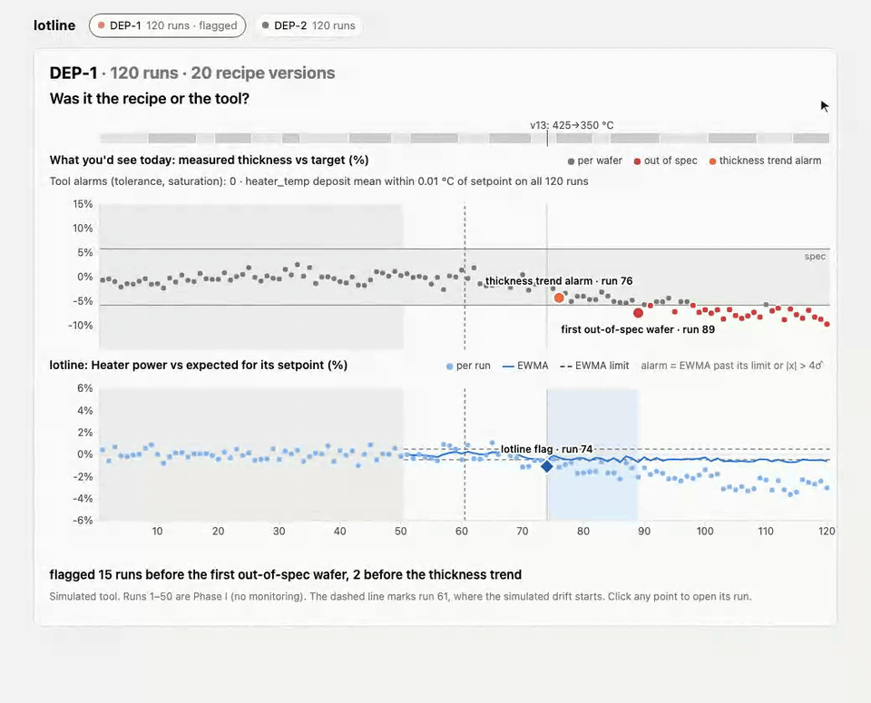

# lotline

By [Ahmed Sozzer](https://amsozzer.com) · [github.com/Amsozzer1](https://github.com/Amsozzer1)

A run-history and tool-health app for simulated chip-processing tools. Everything here is simulated.

A deposition tool runs a recipe that gets edited every few runs, and a wafer comes out thin. Was it the recipe edit or the tool? Thickness on its own can't say, because every new recipe version is a fresh prediction with its own error. The tool's readings can't say either: the heater loop holds the temperature reading on setpoint, so a drifting thermocouple shows up only in how much power the loop needs, and in the film. lotline keeps each run's traces, recipe version and metrology together, and charts heater power and chamber pressure against what each run's recipe should need, pooled across recipe versions. That way it can say which subsystem moved while the recipe kept changing.



*One simulated deposition tool whose recipe is edited every 3 to 8 runs (the strip above the charts). Top, what you'd see today: the tool's tolerance and saturation alarms stay at 0, the temperature reading stays within 0.01 °C of setpoint, and thickness vs target steps at each recipe edit, then walks out of spec (first out-of-spec wafer: run 89). Bottom, lotline: heater power vs expected for its setpoint, pooled across every recipe version, flags at run 74, 15 runs before the first out-of-spec wafer. One click opens run 74. Its banner says heater power has been below expected across recipe versions v12 and v13, the recipe changed at run 72, and the tool config did not change.*

## Results

Measured with `pnpm eval` on this repo's simulator: 200 simulated tools per cell (seeds 1 to 200), and 500 separate tools for calibration (seeds 10001 to 10500). Headline cell: a slow thermocouple drift of 0.113 K per run, which is 0.1 σ of heater power per run, with the thickness spec edge 4 σ from nominal (r = 4).

| Detector | Median lead before the first out-of-spec wafer | Drifts flagged before the first out-of-spec wafer (chance) | False alarms per 1,000 in-control runs (95% CI) |
|---|---|---|---|
| Hold: tool tolerance bands, heater saturation, metrology hold | 0 runs | 0% (0%) | 0.26 [0.19, 0.34] |
| Thickness trend: the same SPC on measured / target | 14 runs | 100% (10%) | 5.63 [4.81, 6.44] |
| **lotline**: the same SPC on heater power and pressure-per-flow vs expected | **16 runs** | **99%** (12%) | 4.78 [4.20, 5.38] |

In this sim, thickness carries each new recipe version's rate error; heater power vs expected for its setpoint doesn't.

lotline's first flag was on the chart of the subsystem that moved in 99% of drifts. In this sim (heater power repeats to 0.5%, 1σ; a new recipe's rate is predicted to within the same σ as run-to-run thickness): if run-to-run thickness σ is below 1.02%, chart thickness instead; from 1.02% up, lotline leads.

*Chance* is the same detector on the same simulated tool with no drift, alarming in the same window. The thickness trend and lotline are calibrated to the same target, 5 false alarms per 1,000 runs per tool, on the 500 calibration tools; the rates above are out of sample. Every number in this README comes from [`results/`](results/), and [`results/numbers.md`](results/numbers.md) says how each was produced.

### Full results

Median runs from drift onset to first alarm (p90), and the share of drifts flagged before the first out-of-spec wafer. Both simulated faults, three drift rates (δ, in σ of the affected tool-health feature per run) and three spec widths (r).

| Scenario | δ (σ/run) | r | Hold | Thickness trend | lotline | lotline first flag on the affected chart |
|---|---|---|---|---|---|---|
| tc_drift | 0.05 | 2 | 11 (28), 85% | 16 (22), 99% | 22 (31), 81% | 97% |
| tc_drift | 0.05 | 4 | 56 (68), 0% | 27 (38), 96% | 22 (31), 100% | 97% |
| tc_drift | 0.05 | 8 | 99 (120), 0% | 41 (61), 98% | 22 (31), 100% | 97% |
| tc_drift | 0.1 | 2 | 10 (19), 57% | 10 (14), 93% | 14 (18), 61% | 99% |
| tc_drift | 0.1 | 4 | 31 (37), 0% | 16 (22), 100% | 14 (18), 99% | 99% |
| tc_drift | 0.1 | 8 | 56 (69), 0% | 27 (38), 96% | 14 (18), 100% | 99% |
| tc_drift | 0.2 | 2 | 7.5 (11), 42% | 7 (9), 79% | 9 (12), 44% | 99% |
| tc_drift | 0.2 | 4 | 17 (21), 0% | 10 (14), 93% | 9 (12), 96% | 99% |
| tc_drift | 0.2 | 8 | 32 (39), 0% | 16 (23), 100% | 9 (12), 100% | 99% |
| mfc_gain_drift | 0.05 | 2 | 9 (20), 93% | 17 (22), 94% | 23 (30), 74% | 96% |
| mfc_gain_drift | 0.05 | 4 | 44 (57), 65% | 26 (37), 98% | 23 (30), 97% | 96% |
| mfc_gain_drift | 0.05 | 8 | 89 (113), 5% | 41 (65), 93% | 23 (30), 99% | 96% |
| mfc_gain_drift | 0.1 | 2 | 7 (14), 91% | 10.5 (14), 90% | 14 (18), 66% | 97% |
| mfc_gain_drift | 0.1 | 4 | 25 (31), 63% | 17 (22), 94% | 14 (18), 96% | 97% |
| mfc_gain_drift | 0.1 | 8 | 51.5 (63), 13% | 26 (37), 97% | 14 (18), 99% | 97% |
| mfc_gain_drift | 0.2 | 2 | 6 (9), 82% | 7 (9), 83% | 9 (12), 48% | 99% |
| mfc_gain_drift | 0.2 | 4 | 14 (18), 54% | 10.5 (14), 89% | 9 (12), 94% | 99% |
| mfc_gain_drift | 0.2 | 8 | 28.5 (35), 21% | 17 (22), 93% | 9 (12), 99% | 99% |

At r = 2 the hold looks fast because its bands are derived from the spec. The pressure band is then narrow enough to trip on in-control noise: 58 false alarms per 1,000 runs. For tc_drift, which does not move pressure, the share of drifts the hold "flags early" matches the share of tools that alarm with no drift at all (the chance column in [`results/detection.csv`](results/detection.csv)). With a fixed throttle, an MFC gain drift also moves deposit pressure, so the tool's own pressure tolerance can catch that fault; the hold's mfc_gain_drift rows show how much it matters.

**Where lotline stops leading.** For each cell, the smallest r (grid 2, 2.5, ..., 8) from which lotline's median lead before the first out-of-spec wafer is strictly greater than the thickness trend's, at that r and every larger one:

| Scenario | δ (σ/run) | r* | Run-to-run thickness σ at r* |
|---|---|---|---|
| tc_drift | 0.05 | 3 | 0.77% |
| tc_drift | 0.1 | 4 | 1.02% |
| tc_drift | 0.2 | 3.5 | 0.90% |
| mfc_gain_drift | 0.05 | 3.5 | 0.90% |
| mfc_gain_drift | 0.1 | 3.5 | 0.90% |
| mfc_gain_drift | 0.2 | 3 | 0.77% |

**Definitions.**
- Per tool, runs 1 to 50 are Phase I: no drift and no monitoring. The heat-loss fit, the flow baseline and each chart's σ̂ freeze at run 50. Monitoring starts at run 51 with every EWMA at 0. Drift starts at run 61, and the window is runs 61 to 260.
- Delay = first alarm − 61 + 1. Lead = first out-of-spec run − first alarm run. An alarm with no out-of-spec wafer in the window counts as lead > 0; an out-of-spec wafer with no alarm counts as lead ≤ 0.
- An alarm is rule 1 (|x| > 4 σ̂) or the EWMA (λ = 0.2) beyond its calibrated limit. After any alarm, that detector's EWMAs restart at 0. Alarms in runs 51 to 60 are ignored for delay and lead and count toward false alarms.
- False alarms are counted on 1,050-run in-control trajectories (runs 51 to 1,050) of the 200 eval tools. Each drift trajectory shares its first 60 runs and its noise with that tool's in-control trajectory, which also gives the chance column.
- Medians of an even count are the mean of the two middle values; p10 and p90 are nearest-rank.

## How it works

```
simulated tool, 10 Hz                          Postgres
heater loop, MFC, chamber ---MQTT---> ingest ---> runs, frames, step summaries,
(or in-process backfill)   one ordered            run features, metrology
                           topic per tool               |
                                                        v
                              API: detectors computed on read ---> tool page, run page

pnpm eval: the same simulator, features and detectors, in process ---> results/
```

- **Simulator** (`src/domain/sim.ts`). A heater stage with conductive and radiative loss, `C dT/dt = η P − (T − T_wall)/R_th − εσA (T⁴ − T_wall⁴)`, under a PI loop on the temperature reading. A mass-flow controller reports its setpoint while delivering `Q (1 + g)`. A fixed-throttle chamber gives `p = p_base + k Q`. Each run has four steps: pumpdown 20 s, stabilize 60 s, deposit 60 to 120 s, purge 10 s. The true state is kept separate from the readings, and film thickness comes from the true stage temperature and delivered flow. Each recipe version has its own unknown rate error, and the target is the engineer's prediction.
- **Schedule.** One recipe lineage per tool, with a new version every 3 to 8 runs. Each version changes the temperature (350 to 425 °C), flow (30 to 80 sccm) or deposit time.
- **Features.** Phase I fits the expected heater power for any setpoint, `P(T) = a (T − T_wall) + c (T⁴ − T_wall⁴)`, by least squares. The heater chart is measured / expected − 1, pooled across recipe versions. The flow chart is (deposit pressure − base pressure) per sccm, relative to its Phase I mean.
- **Detectors** (`src/domain/spc.ts`). One function for every chart: center 0, σ̂ from the RMS over Phase I, and rule 1 or an EWMA. The thickness trend and lotline are calibrated by bisection to the same false-alarm target on separate tools. Calibration refuses to run if rule 1 alone already exceeds the target.
- **Ingest** (`src/server/ingest.ts`). One ordered MQTT topic per tool carries `RunStart`, then 10 Hz frames, then `RunEnd` with the measurement. Duplicates and late messages are dropped by sequence number. Frames go to Postgres with COPY, and features are written in one transaction at run end. The backfill path feeds the same handler.
- **Checks.**
  - A SHA-256 of a seeded run's frames must match on an arm64 Mac and on CI's x64 runner. The first version used the engine's `Math.exp` and `Math.log` and failed this test on CI, so the simulator now uses pure-JavaScript ports of fdlibm's `exp` and `log` ([design notes](docs/design-notes.md)).
  - A parity test sends runs, with injected duplicates, through the handler and Postgres. Stored features must match the eval's fast path to 1e-12 and give the same first alarms.
  - `pnpm verify-demo` checks the running app against `results/demo.json`. `pnpm check-ui` checks chart alignment, markers and the click-through. `pnpm check-live` checks that a run streamed over MQTT stores exactly the eval's features.

| Simulated fault | Where it shows up | Where it doesn't |
|---|---|---|
| Thermocouple bias drift (`tc_drift`) | Heater power vs expected (falls); film thickness (falls) | The temperature reading: the loop holds it on setpoint |
| MFC gain drift (`mfc_gain_drift`) | Pressure per sccm (rises); film thickness (rises); the tool's pressure tolerance, once it is large | The flow reading: the MFC reports its setpoint |

On a real stage, heater power vs expected for its setpoint moves for several reasons. TC drift or lost TC contact makes the stage settle at a different true temperature. Heater-to-stage coupling can change (element bond, clamp). Stage and shield emissivity change between cleans. A second TC separates a sensor fault from a real change in heat loss or coupling. The app never prints a diagnosis.

Built with Claude Code. The MQTT transport is the one my own hardware project, [AMS-X](https://github.com/Amsozzer1/AMS), uses to coordinate filament swaps across 3D printers.

## Run it

```sh
# requirements: nvm, Docker; ffmpeg only for pnpm record-gif
nvm install && corepack enable && pnpm install --frozen-lockfile
docker compose up -d --wait   # Postgres on port 55432, Mosquitto on 1883
pnpm demo                     # backfills two tools and serves http://localhost:8787/tools/dep-1

# in a second shell
pnpm verify-demo              # the app reproduces results/demo.json
pnpm test                     # uses its own database, lotline_test
pnpm eval                     # 3 to 4 minutes; regenerates results/ byte for byte
```

**Watch live ingest.** With the demo running, `pnpm sim --tool dep-2 --speed 20` streams the healthy tool's next run live. Its chip shows "running step N", and the run joins its history and chart.

## Named assumptions

| Parameter | Value |
|---|---|
| Heater-power repeatability, run to run | 0.5% (1σ) |
| Thermocouple drift | 0.057, 0.113, 0.226 K per run (δ = 0.05, 0.1, 0.2) |
| MFC gain drift | 0.072, 0.145, 0.289% per run (δ = 0.05, 0.1, 0.2) |
| Thickness sensitivity to temperature | 1.28% per K at 400 °C (apparent activation energy 0.5 eV) |
| Run-to-run thickness σ | 1.02% at r = 4 (0.51% at r = 2, 2.05% at r = 8) |
| Recipe prediction error, per version | equal to run-to-run thickness σ |
| Thickness spec | ±5.79% at r = 4 (in-control Cpk 1.33) |
| Stage | 200 W loss at 400 °C, half conductive, half radiative; time constant 22.6 s; heater 348 W |
| Readings | temperature ±0.1 °C, flow ±0.05 sccm, pressure ±0.02 mTorr per sample (1σ), at 10 Hz |

## Honest limits

- Everything is simulated: tools, physics, recipes and metrology. The simulator is first-order and generic. Every result depends on the stated parameters, especially r and the recipe prediction error.
- At r = 4, lotline flagged a median 2 runs before the thickness trend (earlier in 58% of drifts, same run in 6%). Attribution: first flag on the moving subsystem's chart in 99% of drifts.
- Gas load on the heater is not modelled.
- Coating build-up between cleans shifts heater power, and the sim leaves it out. A real deployment would re-centre the limits after each clean.
- The chamber has a fixed throttle. On a pressure-controlled chamber, the flow feature would use throttle-valve position instead.
- The heat-loss fit leaves small per-tool offsets between setpoints: median 0.30 σ̂ and p90 0.72 σ̂ across tools.
- Only two faults are simulated, each on its own tool, and each tool runs one recipe lineage.
- lotline flags; it does not hold the tool or suggest the next run.
- MQTT here is a convenient transport, not a semiconductor equipment protocol.

## What I'd do next

- Hold the tool when lotline flags, and release it with a note.
- Maintenance segments: re-centre the limits after a clean or a part swap, keeping σ̂.
- A "next run" panel: deposition rate from runs lotline did not flag, then a suggested deposit time for the next recipe version.
- A leak scenario and a rate-of-rise chamber check, with base pressure joining the tool-health charts.
- A gRPC/protobuf streaming endpoint for in-house tools; SECS/GEM only if third-party tools are added.

## License

MIT
